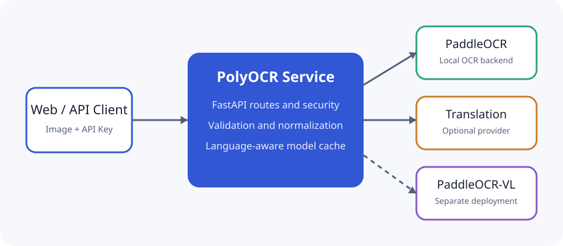

# PolyOCR Service

[English](README_EN.md) | 简体中文


**Powered by PaddleOCR**

PolyOCR Service 是一个面向自托管场景的 OCR HTTP 服务，提供统一响应、API Key
认证、可选翻译适配器和简单 Web 界面。本项目是社区工程，**非 PaddleOCR 官方项目**。

许可证尚未由仓库所有者确认，因此当前不展示许可证徽章，也不声明特定开源许可证。

## 效果预览

启动后访问 `http://localhost:8000/` 可上传图片并查看结构化识别结果；翻译页面位于
`http://localhost:8000/static/translation.html`。页面只把密码框中的 API Key 放入当次
请求头，不持久化到浏览器存储。

## 真实能力

- `POST /v1/ocr`：单图片 OCR，支持语言、置信度阈值和预处理参数。
- `GET /v1/languages`：返回可用语言映射。
- `GET /v1/health`：无需模型下载的健康检查。
- `POST /v2/translate`：可选的 OpenAI 兼容翻译入口。
- 按语言缓存 OCR 模型，限制上传大小并统一错误结构。

基础测试不下载模型。实际 OCR 推理需要安装 `ocr` 额外依赖，首次运行还可能下载
PaddleOCR 模型。

## 架构



主 API、翻译供应商和可选 VL 服务的边界详见
[架构说明](docs/architecture.md)。

## 安装矩阵

| 场景 | Python | 安装命令 |
| --- | --- | --- |
| 开发与快速测试 | 3.10–3.12 | `pip install -e ".[dev]"` |
| 本地 OCR | 3.10–3.12 | `pip install -e ".[ocr]"` |
| 开发并启用 OCR | 3.10–3.12 | `pip install -e ".[dev,ocr]"` |
| CPU 容器 | Docker | `docker compose up --build` |

PaddlePaddle 的架构和平台支持以其官方兼容矩阵为准。

## CPU Docker

```bash
export POLYOCR_API_KEY='replace-with-a-random-secret'
docker compose up --build
```

Compose 不提供真实默认密钥；缺少 `POLYOCR_API_KEY` 时会立即报错。模型缓存在命名卷
`polyocr-models` 中。容器以非 root 用户运行，并通过 `/v1/health` 做健康检查。

## 本地启动

```bash
python -m venv .venv
. .venv/bin/activate
pip install -e ".[dev,ocr]"
cp .env.example .env
uvicorn polyocr.main:create_app --factory --host 127.0.0.1 --port 8000
```

开发环境可将 `POLYOCR_AUTH_ENABLED=false`；对外提供服务时应启用认证并设置高熵密钥。

## OCR 示例

```bash
curl --fail http://localhost:8000/v1/ocr \
  -H "X-API-Key: ${POLYOCR_API_KEY}" \
  -F "file=@sample.png" \
  -F "language=zh" \
  -F "score_threshold=0.5" \
  -F "preprocess=true"
```

成功响应包含 `request_id`、耗时、语言和按行组织的 `items`。服务不会在响应中回显密钥。

## 翻译示例

翻译默认关闭。配置 OpenAI 兼容端点后调用：

```bash
export POLYOCR_TRANSLATION_API_KEY='provider-secret'
export POLYOCR_TRANSLATION_BASE_URL='http://localhost:8001/v1'
export POLYOCR_TRANSLATION_MODEL='your-model'

curl --fail http://localhost:8000/v2/translate \
  -H "X-API-Key: ${POLYOCR_API_KEY}" \
  -H "Content-Type: application/json" \
  -d '{"texts":["hello"],"target_language":"zh"}'
```

未配置供应商时接口返回 `503` 和 `translation_not_configured`，不会尝试联网。

## 配置

全部设置使用 `POLYOCR_` 前缀：

| 变量 | 默认值 | 说明 |
| --- | --- | --- |
| `POLYOCR_AUTH_ENABLED` | `false` | 是否要求 API Key |
| `POLYOCR_API_KEY` | 空 | 服务访问密钥 |
| `POLYOCR_CORS_ORIGINS` | `[]` | JSON 格式允许来源 |
| `POLYOCR_MAX_UPLOAD_MB` | `10` | 最大上传大小 |
| `POLYOCR_DEFAULT_LANGUAGE` | `zh` | 默认 OCR 语言 |
| `POLYOCR_TRANSLATION_API_KEY` | 空 | 非空时启用翻译 |
| `POLYOCR_TRANSLATION_BASE_URL` | 本地示例 | OpenAI 兼容端点 |
| `POLYOCR_TRANSLATION_MODEL` | `change-me` | 翻译模型名 |

## 安全

不要提交 `.env`、访问密钥、内外网 IP、日志、缓存或模型文件。曾出现在 Git 历史中的凭据
必须在供应商侧撤销并轮换；删除当前树中的字符串不能清除历史。完整说明见
[安全指南](docs/security.md)。

## 测试

```bash
pip install -e ".[dev]"
python -m ruff format --check .
python -m ruff check .
python -m pytest -q
```

测试使用内存后端和 `httpx.MockTransport`，快速测试不调用外部服务。

## 基准

固定的小型数据集和复现命令见 [基准说明](benchmarks/README.md)。基准结果是运行时产物，
不得提交；没有实际运行时不应宣称性能数字。

## VL 部署

PaddleOCR-VL 是独立可选服务，使用单独环境变量和依赖。参见
[VL 部署说明](deployment/paddleocr-vl/README.md)。

## 路线图

- 在支持的平台验证固定图片端到端 OCR。
- 增加限流、反向代理和可观测性部署示例。
- 在许可证确认后补充发布元数据。

## 贡献

提交前运行 Ruff、完整测试和仓库卫生测试。行为变更应先添加会失败的测试，再实现最小修复。

## 许可证与致谢

许可证待仓库所有者确认。PolyOCR Service 使用 PaddleOCR 作为可选 OCR 引擎；PaddleOCR
名称和项目归其各自权利人所有。
